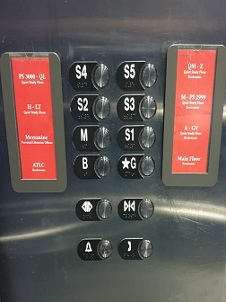

# HCI_HW1_Elevator_Interface

## Links

Presentation Page - https://tiwari-anubhav.github.io/hw1.9.tiwari/
Github Repository - https://github.com/tiwari-anubhav/hw1.9.tiwari
GIF Image - https://github.com/tiwari-anubhav/hw1.9.tiwari/blob/master/hw1.tiwari.gif

## Getting C
The following interface is of the main library TTU

### Control Interface 

   

### Operation of Control Interface 

### Issues with the current design

- The design of the buttons is two-column due to which user has to spend some time to figure out the button
- The buttons have alphabets like B,M which need more explanation.
- Even the floor buttons are accompanied with alphabet S which doesn't have any meaning.
- There is no order in alignment of buttons.
- The LED display is way too far from the buttons.
- There is no audio feedback from the interface.

## Part B

### Common Uses of an elevator

- Moving up and down in a building
- Disabled/Injured people can use elevator instead of stairs
- Moving heavy stuff up and down the building 
Yes, the interface makes doing these common things easier.

### Rare uses of an elevator
- Emergency buttons like Fire and Ask for help
- Door Open button.

### Common Sequence of Actions

- Press up or down button on the outside interface
- Press the desired floor to travel to
- Exit once the elevator stops and the door opens

### Elevator feedback to the user
The elevator usually provides the feedback visually by lighting up the buttons on press or displaying the current floor. It also provides an audio feedback which is just a beeping sound on doors opening and closing

### Improved Control Interface
Following is the screenshot of my design of control interface :

- There is only one vertical column for floor buttons which makes the identification of floors easy and distinguishable for the users. Each floor button gives an audio as well as visual feedback to the user. There is a floor queue list which tells the user how the elevator will move.
- There is additional information which lets the user know about the places on floor and current time. The floor information is clearly visible and aligned with the floor numbers.
- The next and previous buttons let the users to view next set of floors in the building (if any).
- There is only one emergency icon located in the botton middle which is also readily accessible. Door close and open icons are located on bottom right and left respectively.

## Part A

The screensize which for my design interface 500 X 500. Following is the GIF of the interface in action.

